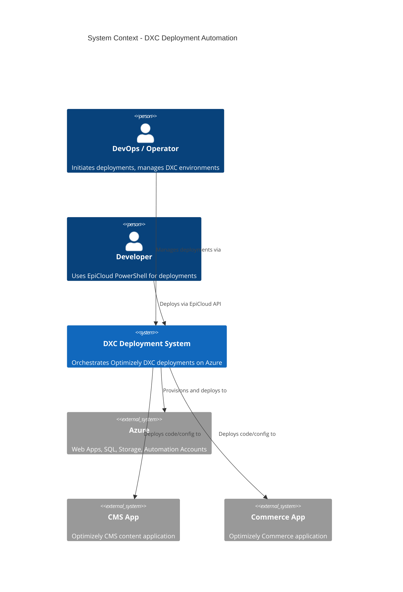
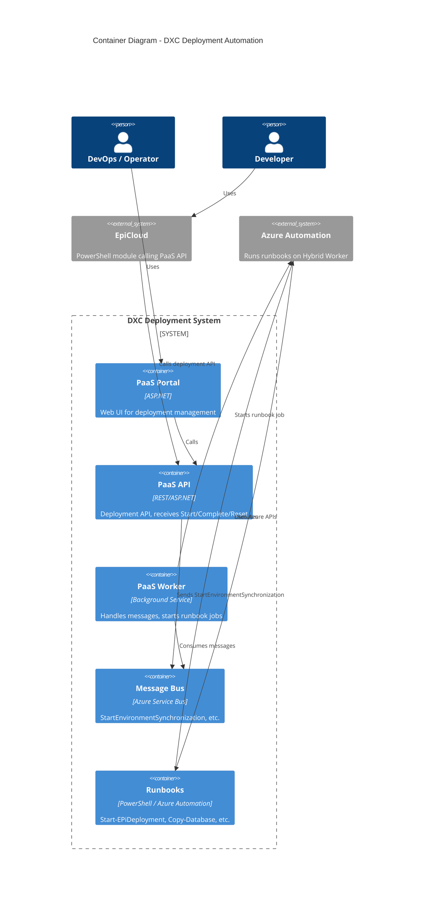
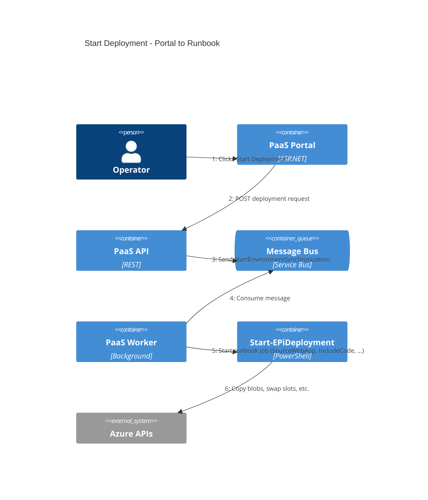
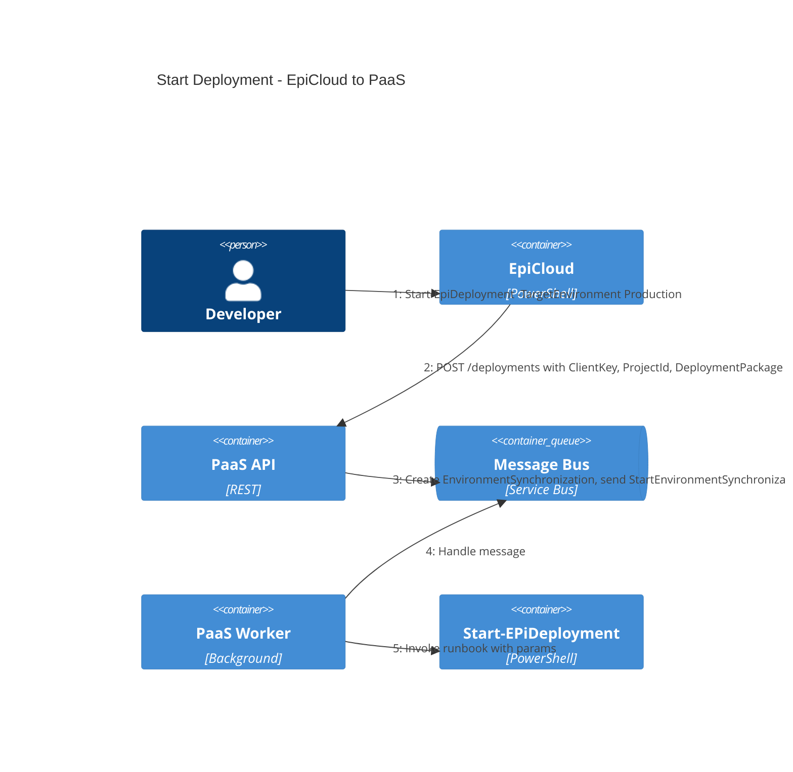
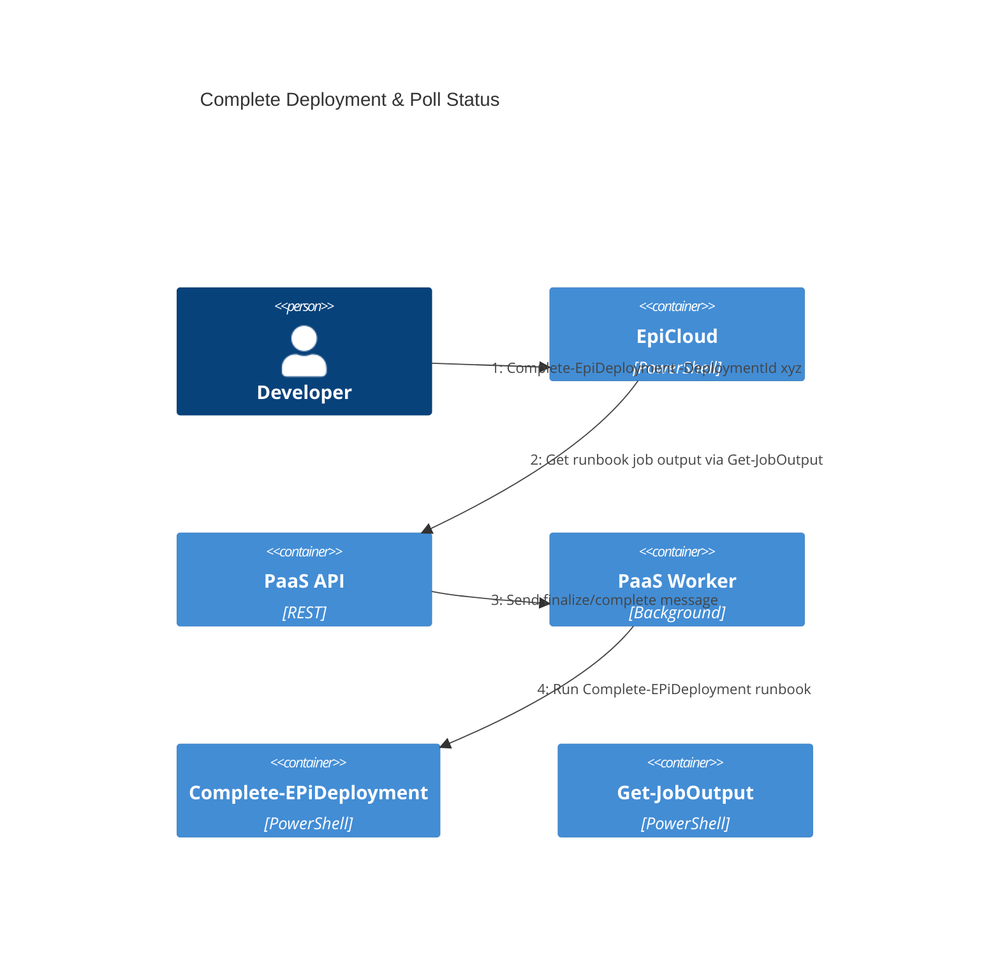
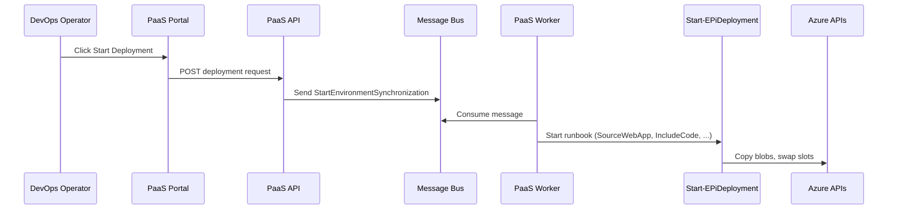
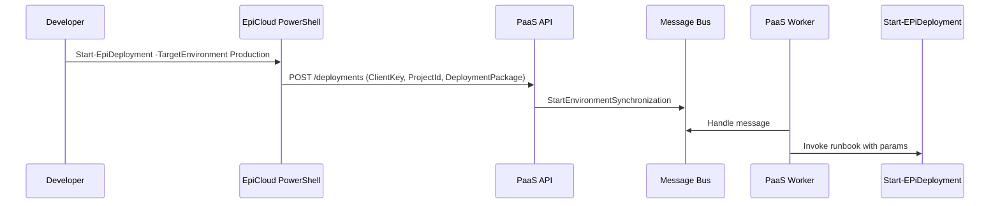
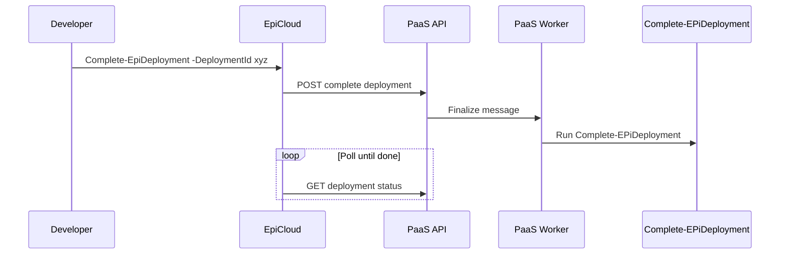

# DXC Deployment Automation – Multi-repo Architecture

This workspace is primarily focused on **DXC (Digital Experience Cloud) deployment automation**. This document describes the C4 architecture model and job/API flows across repos.

---

## C4 Architecture Maps

### Level 1: System Context Diagram

Shows the DXC deployment system and its external users and systems.

---

### Level 2: Container Diagram

Shows the main containers (repos/apps) within the DXC deployment system.

---

## C4 Dynamic Sequence Diagrams

These diagrams show how elements collaborate at runtime for specific flows. Interactions are numbered in order.

### Flow 1: Start Deployment (Portal → Worker → Runbook)

---

### Flow 2: Start Deployment (EpiCloud → PaaS API)

---

### Flow 3: Complete Deployment & Poll Status

---

## Alternative: Mermaid Sequence Diagrams

If C4Dynamic render incorrectly, use these standard sequence diagrams for the same flows.

### Sequence: Start Deployment (Portal)

### Sequence: EpiCloud Start Deployment

### Sequence: Complete Deployment

---

## Repos in this Workspace

| Repo | Role |
|------|------|
| **PaaS** | Portal, API, workers; orchestration and deployment lifecycle |
| **cms** | CMS application / content |
| **commerce** | Commerce application |
| **content-cloudplatform** | Content cloud platform / headless |
| **dxc-deployment-automation** | Runbooks, automation, Azure Automation / deployment scripts |
| **EpiCloud** | PowerShell module for Epi Cloud API (e.g. Start-EpiDeployment, Connect-EpiCloud) |

---

## Job / API Call Chain

### Start Deployment (source → target)

1. **Entry point**: PaaS Portal UI, PaaS API, or EpiCloud PowerShell (`Start-EpiDeployment`)
2. **PaaS** Portal or API receives request → `SynchronizationService` creates `EnvironmentSynchronization`, sends `StartEnvironmentSynchronization` message.
3. **PaaS** Environment sync worker handles message → starts runbook job, invokes **dxc-deployment-automation** runbook (e.g. `Start-EPiDeployment`) with params (SourceWebApp, IncludeCode, resource groups, etc.).
4. **dxc-deployment-automation** runbooks execute in Azure Automation (or Hybrid Worker), call Azure/APIs as needed.
5. **EpiCloud** PowerShell module can be used externally to call PaaS deployment API (e.g. `Start-EpiDeployment`, `Complete-EpiDeployment`).

### Other flows

- **Complete deployment**: `Complete-EpiDeployment` → PaaS API → worker → `Complete-EPiDeployment` runbook
- **Reset deployment**: `Reset-EpiDeployment` → PaaS API
- **Database export**: `Start-EpiDatabaseExport`, `Get-EpiDatabaseExport` → PaaS API

---

## Key Contracts (Messages, APIs, Runbooks)

| From | To | Contract (name / route / runbook) |
|------|----|-----------------------------------|
| PaaS (Portal/API) | PaaS (Worker) | `StartEnvironmentSynchronization` |
| PaaS (Worker) | dxc-deployment-automation | Runbook `Start-EPiDeployment`, params e.g. SourceWebApp, IncludeCode |
| PaaS (Worker) | dxc-deployment-automation | Runbook `Complete-EPiDeployment` |
| External / EpiCloud | PaaS | Deployment API (start, complete, reset, get status) |

---

## Where to Look for Flow Logic

- **PaaS**: `EPiServer.PaaS.Application` (use cases, services), `EPiServer.PaaS.*.Base` (message handlers, sagas), `EPiServer.PaaS.Messages` (commands/events).
- **dxc-deployment-automation**: `ScriptRunbooks/`, runbook names match what PaaS sends. See `AGENTS.md` and `ScriptRunbooks/AGENTS.md`.
- **EpiCloud**: `source/Public/*.ps1` (e.g. `Start-EpiDeployment.ps1`), calls to PaaS API.

---

*Update this file when you add new flows or change how repos interact.*
